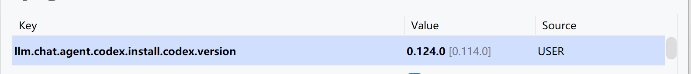

idea会默认检查codex版本，其他托管agent应该同理  
首选去GitHub下载新版codex https://github.com/openai/codex/releases/  
codex-x86_64-pc-windows-msvc.exe.zip  
然后替换idea的本地托管文件  
重点来了，在idea内搜索注册表，注册表内搜索codex，修改版本号  
  
重启即可使用新版codex
