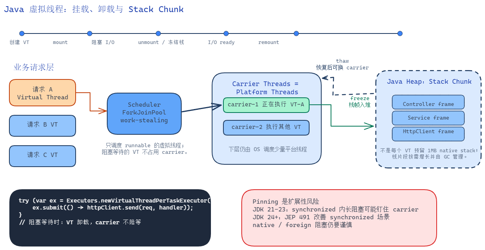

## 写在前面

虚拟线程不是“更快的线程”，也不是把 CPU 算得更快的魔法。它解决的是一个更具体的问题：**当一个服务有大量并发请求，而这些请求的大部分时间都在等待 I/O 时，传统平台线程会把昂贵的操作系统线程浪费在等待上**。虚拟线程让我们重新使用“一个请求一个线程”的同步编程模型，同时把阻塞等待时占用的平台线程释放出来。

这篇文章会围绕几个问题展开：

1. 为什么微服务从同步阻塞走到线程池、Future、Reactive，最后又回到“看起来同步”的虚拟线程？
2. 有栈协程和无栈协程到底差在哪里，为什么 Java 虚拟线程选择了有栈模型？
3. 虚拟线程的 M:N 调度、载体线程、Continuation、挂起恢复到底如何配合？
4. 虚拟线程的栈为什么不会像平台线程一样占用大量内存？Stack Chunk 到底解决了什么？
5. 虚拟线程适合什么场景，不适合什么场景，生产中应该怎样使用和排查？

如果只想记一句话：**虚拟线程的核心价值是让阻塞式代码拥有接近异步 I/O 的并发承载能力，但它不会减少业务本身的等待时间，也不会提升 CPU 密集任务的计算速度。**

## Java 微服务并发模型的演进

### 串行模式：不是 CPU 慢，而是等待太多

一个典型的微服务请求可能要做这些事情：

```text
HTTP request
  -> 查询用户服务
  -> 查询订单数据库
  -> 调用库存服务
  -> 写日志或消息队列
  -> 返回响应
```

如果每一步都串行执行，吞吐量很快就会被 I/O 等待拖垮。假设一次请求总耗时 120 ms，其中真正消耗 CPU 的时间只有 5 ms，其余 115 ms 都在等数据库、网络或磁盘。此时问题不是 CPU 算不过来，而是处理请求的执行单元被迫“坐着等”。

可以用一个非常朴素的并发关系理解吞吐量：

```text
吞吐量 ~= 并发数 / 平均响应时间
```

如果平均响应时间是 100 ms，而你最多只能同时挂住 200 个请求，那么理论吞吐量大约是 2000 QPS。想提高吞吐量，要么降低响应时间，要么提高可承载的并发数。虚拟线程主要提升的是后者。

### 线程池 + Future：把串行等待拆开，但复杂度上升

传统 Java 服务通常使用线程池：

```java
ExecutorService pool = Executors.newFixedThreadPool(200);

Future<User> userFuture = pool.submit(() -> userClient.getUser(userId));
Future<List<Order>> orderFuture = pool.submit(() -> orderClient.listOrders(userId));

User user = userFuture.get();
List<Order> orders = orderFuture.get();
```

这种方式能把互不依赖的 I/O 并行化，但它也带来几个问题：

1. **平台线程仍然昂贵**：Java 平台线程通常 1:1 映射到操作系统线程。线程越多，内核调度、上下文切换、栈内存占用越明显。
2. **等待没有消失**：`Future.get()` 阻塞时，当前平台线程仍然被占住。
3. **依赖关系会让代码变形**：一旦出现“先查 A，再用 A 的结果查 B，同时 C 和 D 可并行”的场景，代码会迅速变成编排逻辑。
4. **线程池大小成为业务风险**：太小会排队，太大会压垮机器、数据库或下游服务。

线程池解决了“不能无限创建线程”的问题，但没有解决“阻塞等待会占住平台线程”的问题。

### 事件驱动与 Reactive：等待不占线程，但业务被拆成事件流

NIO、Netty、WebFlux、RxJava 经常被放在一起说，但它们不是同一层东西：

| 名称 | 所在层次 | 解决的问题 | 核心机制 |
| --- | --- | --- | --- |
| Java NIO | JDK I/O API | 一个线程如何管理多个连接 | `Selector` + `Channel` + readiness 事件 |
| Netty | 网络框架 | 高性能 TCP/HTTP 编程模型 | `EventLoop` + `ChannelPipeline` + `ByteBuf` |
| WebFlux | Web 框架 | Spring Web 层如何非阻塞处理请求 | Reactor `Mono` / `Flux` + Reactive Streams |
| RxJava | Reactive 库 | 内存事件流、异步任务组合 | `Observable` / `Flowable` + Scheduler + operators |

它们共同追求的是：**等待 I/O 的时候不要占住线程**。但代价是：业务执行不再天然表现为一条连续调用栈，而是被拆成“事件到达后继续执行下一段逻辑”。

#### Java NIO：Selector 不是帮你读数据，而是告诉你“现在可以读”

传统阻塞 I/O 是这样：

```text
thread-1 -> socket.read() -> 没数据 -> thread-1 阻塞
thread-2 -> socket.read() -> 没数据 -> thread-2 阻塞
thread-3 -> socket.read() -> 没数据 -> thread-3 阻塞
```

NIO 的思路是把 socket 设置为非阻塞，然后把多个 `Channel` 注册到一个 `Selector`：

```java
Selector selector = Selector.open();
channel.configureBlocking(false);
channel.register(selector, SelectionKey.OP_READ);

while (true) {
    selector.select(); // 当前线程睡眠，直到至少一个 channel ready
    for (SelectionKey key : selector.selectedKeys()) {
        if (key.isReadable()) {
            SocketChannel ch = (SocketChannel) key.channel();
            ch.read(buffer); // 此时读通常不会长时间阻塞
        }
    }
}
```

这里有一个容易误解的点：`Selector` 不负责“把数据读出来”，它只负责告诉你“哪些连接现在可读、可写、可 accept、可 connect”。真正读写仍然由应用代码调用 `Channel.read()` / `Channel.write()` 完成。

所以 NIO 的本质是：

```text
大量连接
  -> 注册到 Selector
  -> 少量线程调用 select()
  -> 操作系统通知哪些 fd ready
  -> 应用代码处理 ready 事件
```

优点是线程少。缺点是业务代码必须适应事件模型：一次读不一定读完整包，一次写不一定写完，半包、粘包、缓冲区管理、状态保存都要处理。

#### Netty：把 NIO 的脏活封装成 EventLoop 和 Pipeline

Netty 是对 NIO 的工程化封装。它把常见复杂度收进几个核心抽象：

1. `EventLoop`：一个事件循环线程，负责一组 Channel 的 I/O 事件和任务队列。
2. `Channel`：一个连接或一个服务端监听 socket。
3. `ChannelPipeline`：处理链，入站事件从头到尾传播，出站事件反向传播。
4. `ChannelHandler`：业务处理器，比如解码、编码、鉴权、业务逻辑。
5. `ByteBuf`：比 `ByteBuffer` 更适合网络编程的缓冲区抽象。

一个简化的 Netty 流程是：

```text
EventLoop.select()
  -> 某个 Channel 可读
  -> 读取 bytes 到 ByteBuf
  -> ChannelPipeline.fireChannelRead()
  -> Decoder 把 bytes 变成 Request
  -> BusinessHandler 处理 Request
  -> Encoder 把 Response 变成 bytes
  -> EventLoop 写回 socket
```

Netty 的关键约束是：**同一个 Channel 的 I/O 事件通常由同一个 EventLoop 线程串行处理**。这减少了锁竞争，但也意味着不能在 EventLoop 里做长时间阻塞调用：

```java
public void channelRead(ChannelHandlerContext ctx, Object msg) {
    // 错误示例：如果这里查数据库阻塞 200ms，这个 EventLoop 上的其他连接也会被拖住
    User user = jdbcTemplate.queryForObject(...);
    ctx.writeAndFlush(user);
}
```

所以 Netty 服务通常要么全链路异步，要么把阻塞任务丢到业务线程池，再把结果投递回 EventLoop。

#### WebFlux：把 HTTP 请求变成 Reactive Streams

Spring WebFlux 建立在 Reactor 之上，核心返回类型是：

1. `Mono<T>`：最多 0 或 1 个元素的异步结果。
2. `Flux<T>`：0 到 N 个元素的异步序列。

传统 Spring MVC 是：

```java
User getUser(String id) {
    return userService.getUser(id);
}
```

WebFlux 是：

```java
Mono<User> getUser(String id) {
    return userClient.get()
            .uri("/users/{id}", id)
            .retrieve()
            .bodyToMono(User.class);
}
```

这段代码不会立刻得到 `User`，而是构建了一条执行链。只有订阅发生时，数据才沿着链路流动：

```text
Subscriber 订阅
  -> 向上游 request(n)
  -> 上游发起 I/O
  -> 数据 ready 后 onNext
  -> 完成时 onComplete
  -> 异常时 onError
```

WebFlux 的优势是适合非阻塞 HTTP、SSE、WebSocket、流式响应。代价是函数颜色会扩散：一旦 controller 返回 `Mono<User>`，service、client、repository 很容易都变成 `Mono` / `Flux` 风格。

#### RxJava：不是网络框架，而是事件流组合库

RxJava 更偏通用异步和事件流组合。它关心的是“数据流如何变换、合并、切换线程、处理错误”，不直接等同于 NIO 或 Web 框架。

典型代码：

```java
Flowable.fromIterable(ids)
        .flatMap(id -> queryUser(id).toFlowable(), 32)
        .map(this::toView)
        .observeOn(Schedulers.computation())
        .subscribe(this::render, this::handleError);
```

这里的核心不是“一个线程处理多个 socket”，而是：

1. `map`、`flatMap`、`zip`、`merge` 等算子组合数据流。
2. `subscribeOn` 决定上游从哪个 Scheduler 开始执行。
3. `observeOn` 切换下游观察者在哪个 Scheduler 执行。
4. `Flowable` 支持背压，`Observable` 不强制背压。

#### 背压：下游处理不过来时，不能让上游无限生产

背压（back pressure）是 Reactive 里非常重要但容易被一句话带过的概念。它解决的是生产速度和消费速度不匹配的问题。

假设上游每秒产生 100 万条消息，下游每秒只能写数据库 1 万条。如果没有背压，只能有几个坏结果：

1. 内存队列越来越大，最后 OOM。
2. 丢数据。
3. 上游把下游压垮。
4. 请求延迟无限升高。

Reactive Streams 的做法是把“需求”显式化。核心接口是：

```java
interface Subscription {
    void request(long n);
    void cancel();
}
```

也就是说，下游不是被动接收无限数据，而是告诉上游：“我现在还能处理 n 个”。一个简化流程是：

```text
Subscriber: request(32)
Publisher : onNext 1
Publisher : onNext 2
...
Subscriber: 处理完一批后继续 request(32)
```

这和虚拟线程的思路不一样。虚拟线程让同步阻塞代码更便宜，但它不会自动解决“生产者比消费者快”的问题。即使用虚拟线程，如果你无限提交写库任务，数据库仍然会崩。因此虚拟线程程序也需要限流、队列上限、`Semaphore`、连接池和超时。

#### 为什么说事件驱动把代码拆成状态机

事件驱动模型里，等待 I/O 时不能把线程停在当前函数栈上。所以运行时或框架必须把“下一步要做什么”保存到对象里：

```text
当前阶段：等待 HTTP 响应
已保存状态：userId、traceId、回调函数、下游 subscriber、缓冲区
事件到达后：继续执行 onNext / callback / pipeline 下一个 handler
```

这就是“把调用栈变成状态机”的含义。程序的物理执行不再是：

```text
controller -> service -> client -> wait -> return
```

而是：

```text
controller 创建 Mono
  -> 订阅后注册回调
  -> I/O ready
  -> EventLoop 调用 callback
  -> callback 推动下一个 operator
```

Reactive 的本质不是让 I/O 更快，而是用编程复杂度换资源效率。虚拟线程想做的事情恰好相反：**保留同步阻塞代码的可读性，同时由 JVM 在阻塞点释放底层平台线程**。

## 有栈与无栈：协程模型的核心分歧

讨论虚拟线程前，必须先理解“有栈”和“无栈”。这个概念不是语法层面的，而是运行时如何保存“执行到哪里了”。

### 什么是执行状态

一个正在运行的函数不只有代码位置，还有一组执行状态：

```java
Order handle(Request request) {
    User user = loadUser(request.userId());       // 局部变量 user
    List<Item> items = loadItems(user.id());      // 局部变量 items
    return buildOrder(user, items);               // 当前执行位置
}
```

如果在 `loadItems()` 等待网络 I/O 时挂起，恢复时必须知道：

1. 当前执行到哪一行。
2. 局部变量 `request`、`user` 还在。
3. 调用链上每一层函数的返回地址还在。
4. 恢复后能继续像普通函数一样返回。

保存这些信息有两种主流方式：有栈和无栈。

### 无栈协程：把“下一步”保存成状态机

无栈协程的关键不是“没有任何栈”，而是：**挂起后不保存完整调用栈，只保存恢复所需的局部状态和下一步编号**。运行时恢复它时，不是把一条旧调用栈原样搬回来，而是再次进入一个状态机分支。

以伪代码为例：

```text
async function handle() {
  const user = await loadUser();
  const orders = await loadOrders(user.id);
  return render(user, orders);
}
```

它可以被理解成：

```text
state = 0:
  发起 loadUser()
  注册 continuation: 完成后回到 state = 1
  返回一个 Promise，当前 JS 调用栈清空

state = 1:
  取出 user
  发起 loadOrders(user.id)
  注册 continuation: 完成后回到 state = 2
  当前 JS 调用栈再次清空

state = 2:
  取出 orders
  执行 render(user, orders)
  resolve 最外层 Promise
```

这里保存的状态大致是：

```text
AsyncFunctionState {
  state: 1,
  locals: {
    user: User(...),
    requestId: "..."
  },
  resume: function continuation(...)
}
```

这不是某个语言的真实字段名，而是帮助理解的模型。真实实现由 JS 引擎、编译器和运行时决定。

#### JavaScript async/await 是怎么实现状态机的

JavaScript 的 `async function` 调用后会立刻返回一个 `Promise`。函数执行到 `await` 时，会把 `await` 后面的表达式转成 Promise 语义：

```javascript
async function f() {
  console.log("A");
  const x = await p;
  console.log("B", x);
}
```

执行过程可以理解为：

```text
调用 f()
  -> 打印 A
  -> 遇到 await p
  -> 当前 async 函数暂停
  -> 把“继续执行 console.log('B', x)”注册为 Promise reaction
  -> f() 返回 Promise
  -> 当前同步调用栈结束

p fulfilled
  -> continuation 被放入 microtask queue
  -> 当前宏任务结束后，事件循环清空 microtask
  -> 恢复 async 函数，从 await 后继续
```

所以 JS 的“恢复”不是恢复一整条原生调用栈，而是在 microtask 中重新调用一段 continuation。同步调用栈在 `await` 处已经清空了。

可以用这段代码观察顺序：

```javascript
async function demo() {
  console.log("1");
  await Promise.resolve();
  console.log("3");
}

demo();
console.log("2");
```

输出是：

```text
1
2
3
```

原因是 `await` 后的 `console.log("3")` 被放到了 microtask queue 里。它不是在原来的同步调用栈里继续执行，而是在当前同步代码跑完后由事件循环调度。

这就是无栈模型的核心代价：如果深层函数要等待，它自己必须是 async，调用它的函数也往往要 async：

```javascript
async function repository() {
  return await fetch("/user");
}

async function service() {
  return await repository();
}

async function controller() {
  return await service();
}
```

异步性质沿调用链传播，这就是“函数颜色”。普通函数不能随便调用 async 函数并直接拿到结果，只能拿到 Promise。

### 有栈协程：保存完整的逻辑调用栈

有栈协程的思路是：**每个并发任务拥有自己的逻辑调用栈，运行时可以在深层函数中挂起并恢复整条调用链**。

这里的“调用栈”可以理解成一串栈帧。每一帧代表一个还没返回的方法调用：

```text
VirtualThread-A stack

top
┌────────────────────────────────────┐
│ HttpClient.readResponse()           │
│ locals: buffer, socket, timeout     │
│ return pc: readResponse 后下一行    │
├────────────────────────────────────┤
│ UserClient.getUser()                │
│ locals: userId, request             │
│ return pc: getUser 后下一行         │
├────────────────────────────────────┤
│ UserService.loadUser()              │
│ locals: id, cacheKey                │
│ return pc: loadUser 后下一行        │
├────────────────────────────────────┤
│ Controller.handle()                 │
│ locals: request, traceId            │
│ return pc: handle 后下一行          │
└────────────────────────────────────┘
bottom
```

这个栈不是只保存“下一步编号”，而是保存了整条调用链上每一层的局部变量、返回位置和运行时元数据。因此 `HttpClient.readResponse()` 内部挂起后，恢复时可以继续返回给 `UserClient.getUser()`，再返回给 `UserService.loadUser()`，最后回到 `Controller.handle()`。

这意味着下面这种代码也可以自然工作：

```java
Response handle(Request request) {
    User user = userService.load(request.userId());
    Order order = orderService.load(user.id());
    return render(user, order);
}
```

`userService.load()` 内部可能经过很多层封装，最终在 socket read 上阻塞。对业务代码来说，它就是普通方法调用；对运行时来说，阻塞点可以触发挂起，保存当前调用栈，释放底层执行线程。

#### 有栈协程的栈一般存在哪里

不同运行时做法不同，但大体有三种：

1. **固定大栈**：每个协程预留一大块连续内存。实现简单，但大量协程会浪费内存。
2. **分段栈**：栈由多个小段组成，不够时加一段。早期 Go 使用过类似思路，但频繁跨段会有性能问题。
3. **可增长 / 可移动栈**：初始栈很小，不够时分配更大的栈并复制旧栈，运行时修正指针。现代 Go goroutine 采用这种思路。

有栈协程的难点是：栈里不只有普通值，还可能有对象引用、返回地址、锁记录、异常处理信息、调试信息。如果运行时要移动、冻结或扫描这条栈，就必须知道每个位置到底是什么。

#### Go goroutine 是怎么实现有栈协程的

Go 的 goroutine 是有栈的。每个 goroutine 有自己的用户态栈，初始很小，随着调用深度增长。它不是每个 goroutine 绑定一个 OS thread 的 native stack，而是由 Go runtime 管理。

Go 的调度模型通常被称为 G-M-P：

```text
G = goroutine，待执行的任务和它的栈
M = machine，操作系统线程
P = processor，调度资源和本地运行队列
```

简化关系：

```text
很多 G
  -> 放在 P 的本地队列或全局队列
  -> M 拿到 P 后执行 G
  -> G 阻塞、让出或被抢占后，M 可以执行其他 G
```

Go 的 goroutine 栈大致长这样：

```text
goroutine G123
  stack bounds: [lo, hi]
  stack pointer: sp
  frames:
    main.handle()
    service.load()
    net/http.(*Client).Do()
    runtime.netpollblock()
```

当调用链变深、当前 goroutine 栈不够时，runtime 会扩容：分配更大的栈，把旧栈内容复制过去，并修正栈内指针。因为 Go runtime 和编译器知道栈帧布局，所以它能完成这件事。GC 也会扫描 goroutine 栈上的对象引用。

所以 Go 的“有栈”不是“每个 goroutine 都占用一个 1MB OS 栈”，而是“每个 goroutine 有自己的 runtime-managed 栈”。这和 Java 虚拟线程的理念相似：都保留同步调用栈语义，但都避免为每个任务绑定昂贵 OS 线程栈。

#### 为什么有栈运行时要处理 GC、异常、锁和 native 边界

这句话如果不展开，确实很空。逐个解释：

1. **GC**：栈帧里可能有对象引用。虚拟线程挂起后，引用不在 carrier 的 native stack 上，而在堆上的 Stack Chunk 或运行时管理的栈里。GC 必须能扫描这些冻结栈帧，否则对象可能被误回收。
2. **异常**：异常传播依赖调用栈展开。`try/catch/finally`、异常栈追踪、`StackWalker`、调试器都需要看到合理的调用链。运行时不能因为挂起恢复就把业务栈弄断。
3. **监视器锁**：Java 的 `synchronized` 和对象 monitor 与栈帧、锁记录、线程身份有关。如果线程在持有 monitor 时挂起，运行时必须保证锁语义不坏，或者干脆禁止卸载，这就引出 pinning。
4. **native 调用**：native 代码运行在真实 OS 线程的 C/C++ 栈上，JVM 很难安全复制或冻结它。native 函数可能持有裸指针、JNI 引用、系统调用状态，所以虚拟线程进入 native 边界后通常不能像纯 Java 帧那样自由卸载。

这就是有栈协程实现复杂的根源：它不是保存几个局部变量，而是让整个运行时都承认“这条可挂起的调用栈是真实线程语义的一部分”。

优点：

1. 挂起可以发生在深层调用中，不需要把整条调用链改成 async。
2. 同步代码、异常、try-with-resources、调试栈更符合 Java 程序员的直觉。
3. 老代码迁移成本低，尤其适合 JDBC、HTTP Client、RPC Client 这类同步 API。

缺点：

1. 运行时必须能保存、恢复、扫描调用栈，实现复杂。
2. 如果每个协程都预分配大块连续栈内存，会浪费内存。
3. 运行时要处理 GC、异常、监视器锁、native 调用等复杂边界。

### 对比表

| 维度 | 有栈协程 / 虚拟线程 | 无栈协程 / async 状态机 |
| --- | --- | --- |
| 状态保存 | 保存逻辑调用栈 | 保存状态机字段和挂起点 |
| 挂起位置 | 可在深层调用栈中挂起 | 通常只能在显式 `await` / `suspend` 点挂起 |
| 对 API 的影响 | 普通同步方法可以保持同步签名 | 调用链往往需要 async 类型传播 |
| 调试体验 | 更接近普通线程栈 | 依赖语言和框架重建异步栈 |
| 内存模型 | 需要栈管理，Java 使用可增长 Stack Chunk | 保存必要局部状态，通常更小 |
| 适合场景 | 大量阻塞式 I/O，保留同步代码 | UI、事件流、显式异步编排、语言级 async |
| 代表 | Java Virtual Thread、Go goroutine | JavaScript async/await、C# async、Kotlin suspend |

这里容易误解的一点是：**有栈不等于一定要为每个任务预分配 1 MB 栈**。Java 虚拟线程选择的是有栈语义，但不是传统平台线程那种固定或大块连续 native stack。它使用的是按需增长、可被 GC 管理的栈片段。

## JVM 虚拟线程的整体结构

JEP 444 将虚拟线程作为 Java 21 的正式特性发布。官方目标非常明确：让服务端应用能用简单的“thread-per-request”风格获得更高吞吐，而不是要求开发者改写为异步回调模型。



虚拟线程涉及几类角色：

| 名称 | 含义 |
| --- | --- |
| Virtual Thread | Java 暴露给业务代码的轻量线程，`java.lang.Thread` 的一种 |
| Continuation | JVM 内部用于保存和恢复执行状态的机制，业务代码不应直接依赖 |
| Stack Chunk | 虚拟线程栈在堆上的分段存储结构 |
| Scheduler | JVM 调度虚拟线程的调度器，默认基于 ForkJoinPool |
| Carrier Thread | 真正执行虚拟线程代码的平台线程 |
| OS Thread | 操作系统内核调度的线程 |

可以把关系理解成：

```text
很多 Virtual Thread
  -> 被 Scheduler 分配到少量 Carrier Thread
  -> Carrier Thread 本身是 Platform Thread
  -> Platform Thread 1:1 映射到 OS Thread
```

这就是常说的 M:N 模型：M 个虚拟线程复用 N 个平台线程。

### Continuation 在 JVM 里扮演什么角色

`Continuation` 可以翻译成“延续体”。它表示一段可以暂停、保存、恢复的执行过程。业务代码不直接操作它，但虚拟线程内部依赖它。

可以把虚拟线程理解成：

```text
VirtualThread {
  continuation: Continuation
  scheduler: ForkJoinPool
  state: NEW / RUNNABLE / PARKED / TERMINATED ...
}
```

这不是源码字段的完整还原，而是模型化理解。关键是：`VirtualThread` 是 Java 层看到的线程对象；`Continuation` 是 JVM 用来保存“线程执行到哪里”的内部载体。

一个 Continuation 里至少要表达几类信息：

1. 属于哪个虚拟线程。
2. 当前是否已经挂起。
3. 挂起时保存的栈片段在哪里。
4. 恢复后从哪个字节码位置继续。
5. 栈帧里哪些位置是对象引用，方便 GC 扫描。

当虚拟线程运行时，它的 Java 栈帧临时在 carrier thread 上执行；当它要挂起时，HotSpot 会把可冻结的 Java 栈帧从 carrier 的执行栈中复制 / 冻结到堆上的 Stack Chunk。这个动作常被称为 freeze。恢复时再把它接回执行上下文，常被称为 thaw。

简化过程：

```text
run continuation
  -> Java frames 在 carrier 上执行
  -> 遇到可挂起阻塞点
  -> freeze：把 Java frames 保存为 Stack Chunk
  -> continuation yield
  -> carrier 空出来

I/O ready
  -> continuation 重新入队
  -> scheduler 选择 carrier
  -> thaw：恢复 Java frames
  -> 从阻塞点之后继续执行
```

这里有两个重要细节：

1. 虚拟线程挂起时保存的是 Java 帧，不是任意 native 帧。纯 Java 调用链可以被 JVM 理解和复制；native 调用栈不能这样处理。
2. 恢复后不要求回到同一个 carrier thread。虚拟线程身份和 carrier 身份是分离的。

### Stack Chunk 到底长什么样

`Stack Chunk` 不是“一个普通 Java 数组保存所有局部变量”这么简单。更准确地说，它是 HotSpot 用来保存一段虚拟线程栈帧的堆对象。一个虚拟线程的逻辑栈可以由多个 chunk 串起来。

概念结构可以这样想：

```text
VirtualThread
  -> Continuation
      -> StackChunk tail
          ┌──────────────────────────┐
          │ chunk metadata            │
          │ size / sp / pc / flags    │
          │ oops map / frame layout   │
          ├──────────────────────────┤
          │ frame: HttpClient.read    │
          │   locals                  │
          │   operand stack           │
          │   return pc               │
          ├──────────────────────────┤
          │ frame: UserClient.get     │
          │   locals                  │
          │   operand stack           │
          │   return pc               │
          ├──────────────────────────┤
          │ link to previous chunk    │
          └──────────────────────────┘
```

Java 方法栈帧本来就包含几类东西：

1. **局部变量表**：方法参数和局部变量，比如 `this`、`userId`、`buffer`。
2. **操作数栈**：JVM 字节码执行时的临时计算区域。
3. **返回地址 / 程序计数器信息**：当前方法返回后从哪里继续。
4. **运行时元数据**：方法信息、oop map、monitor 信息等。

Stack Chunk 要保存的正是这些能够让方法继续执行的信息。它必须让 GC 知道哪些槽位是对象引用，也必须让异常、调试器、线程 dump 能重建一条合理的调用栈。

为什么它在堆上很关键？因为堆对象可以由 GC 管理，而不需要每个虚拟线程长期占有一块 OS native stack。大量虚拟线程阻塞时，内存形态从：

```text
大量 OS thread native stack
```

变成：

```text
少量 carrier native stack
+ 大量堆上的 VirtualThread / Continuation / StackChunk
```

这就是虚拟线程能承载大量阻塞任务的基础。

## 虚拟线程的生命周期：mount、unmount、remount

一个虚拟线程并不是一直绑定某个平台线程。它有两个关键动作：

1. **mount**：虚拟线程被挂载到某个载体线程上执行。
2. **unmount**：虚拟线程遇到可挂起的阻塞操作，保存执行状态，释放载体线程。

典型流程如下：

```text
创建虚拟线程
  -> 进入调度器队列
  -> 挂载到 carrier thread
  -> 执行业务代码
  -> 遇到 socket read / sleep / blocking queue 等可挂起阻塞点
  -> 保存 continuation 和栈状态
  -> 从 carrier thread 卸载
  -> carrier thread 执行其他虚拟线程
  -> I/O 就绪后，虚拟线程重新入队
  -> 可能挂载到另一个 carrier thread 继续执行
```

这解释了一个重要现象：**虚拟线程不是固定运行在某个平台线程上**。如果你在线程名、ThreadLocal、native 代码里假设“一个请求永远在同一个 OS 线程上”，就可能出现问题。

不过从 Java 代码角度看，它仍然是一个 `Thread`：

```java
Thread.startVirtualThread(() -> {
    // 这里可以写普通阻塞代码
    var user = userClient.getUser(userId);
    var orders = orderClient.listOrders(user.id());
    render(user, orders);
});
```

或者使用每任务一个虚拟线程的 Executor：

```java
try (var executor = Executors.newVirtualThreadPerTaskExecutor()) {
    Future<User> user = executor.submit(() -> userClient.getUser(userId));
    Future<List<Order>> orders = executor.submit(() -> orderClient.listOrders(userId));

    return render(user.get(), orders.get());
}
```

注意这里不应该再像平台线程一样建一个“固定大小虚拟线程池”。虚拟线程本身不应该被池化，真正要限制的是数据库连接、下游 QPS、消息队列写入速率等外部资源。限制资源应该使用连接池、`Semaphore`、限流器或 Bulkhead，而不是限制虚拟线程数量。

## 栈：虚拟线程最关键的实现点

### 平台线程的栈为什么贵

传统平台线程的调用栈通常是操作系统线程的一部分。创建大量平台线程时，即使每个线程没有真正跑满栈，也需要为栈保留地址空间，并伴随内核调度结构、TLS、上下文切换等成本。

在服务端程序里，大多数线程并不是在持续计算，而是在等待：

```text
Thread-17
  Java frame: Controller.handle
  Java frame: Service.load
  Java frame: HttpClient.send
  Native/OS: wait socket readable
```

线程阻塞时，它的整条调用栈都留在那里，平台线程也不能去跑别的请求。这就是“一个请求一个平台线程”扩展性差的根本原因。

### 虚拟线程的栈为什么可以轻量

虚拟线程仍然有自己的逻辑调用栈，所以它是有栈模型。但这条栈不是长期占用某个平台线程的 native stack，而是可以在挂起时以 **Stack Chunk** 的形式保存在 Java 堆上。

可以这样理解：

```text
运行时：
  虚拟线程挂载在 carrier 上，使用 carrier 执行 Java 帧

遇到可挂起阻塞点：
  JVM 将 continuation 的栈帧保存到堆上的 Stack Chunk
  虚拟线程从 carrier 卸载
  carrier 继续执行其他虚拟线程

恢复时：
  JVM 从 Stack Chunk 恢复执行状态
  虚拟线程挂载到某个 carrier
  从阻塞点之后继续执行
```

Stack Chunk 的意义有三层：

1. **按需增长**：虚拟线程不需要一开始就预留大块连续栈。
2. **可移动、可回收**：栈片段作为堆对象由 JVM 管理，不再强依赖操作系统线程生命周期。
3. **保留同步语义**：业务代码仍然看到普通调用栈，而不是手写状态机。

这也是虚拟线程和“回调式异步”的根本差别。Reactive 代码在等待时保存的是回调和状态机；虚拟线程在等待时保存的是 continuation 和调用栈片段。

### 栈不是无限的

虚拟线程的栈更轻量，但不代表可以无限递归。深递归、巨大栈帧、复杂调用链仍然会消耗内存，也仍然可能触发 `StackOverflowError`。虚拟线程降低的是“为大量等待中的任务保留平台线程栈”的浪费，不是取消栈成本。

也不要把虚拟线程理解成“每个虚拟线程完全没有成本”。一个虚拟线程至少有 `VirtualThread` 对象、Continuation 状态、栈片段、调度队列节点以及业务对象引用。它很轻，但不是零成本。

## 阻塞如何变成“可挂起”

虚拟线程要成立，关键不是“线程便宜”这么简单，而是 JDK 必须改造大量阻塞点，让它们在虚拟线程中阻塞时可以触发 unmount。

典型可挂起操作包括：

1. `Thread.sleep(...)`
2. `BlockingQueue.take()`
3. `Socket` / `ServerSocket` 相关网络 I/O
4. JDK HTTP Client 的阻塞调用
5. 多数基于 JDK 可中断阻塞原语构建的同步 API

当虚拟线程执行这些操作时，JDK 内部会识别当前线程是虚拟线程，并尝试把等待动作交给底层异步或轮询机制，然后卸载当前虚拟线程。这样 carrier thread 不需要陪着它一起等。

### BlockingQueue.take() 是什么

`BlockingQueue` 是 `java.util.concurrent` 里的阻塞队列接口。它常用于生产者-消费者模型：

```java
BlockingQueue<Task> queue = new LinkedBlockingQueue<>();

// 消费者
Task task = queue.take(); // 如果队列为空，就一直等到有元素
handle(task);
```

`take()` 的语义是：**取出并移除队首元素；如果队列为空，就阻塞等待**。

在平台线程时代，如果 1000 个线程都卡在 `queue.take()`，那就是 1000 个平台线程在等待。在线程 dump 里你会看到很多线程停在 `Unsafe.park`、`LockSupport.park`、`Condition.await` 之类的位置。

虚拟线程时代，关键变化是：当虚拟线程执行到这些 JDK 可识别的阻塞等待点时，它可以 park 自己并卸载 carrier。简化理解：

```text
VT-A 调用 queue.take()
  -> 队列为空
  -> VT-A 进入等待队列
  -> VT-A park / yield continuation
  -> carrier thread 被释放

生产者 put(task)
  -> 唤醒等待中的 VT-A
  -> VT-A 回到 scheduler 队列
  -> 某个 carrier remount VT-A
  -> take() 返回 task
```

这说明虚拟线程不是只对 socket I/O 有用。只要阻塞点最终基于 JDK 可挂起的 park / blocking 机制，就有机会释放 carrier。

不过要注意：`BlockingQueue` 本身仍然是同步协调结构。如果生产速度远大于消费速度，队列仍然可能堆积。虚拟线程能降低“消费者等待时占用线程”的成本，但不能自动解决容量、延迟和背压问题。

这也是为什么虚拟线程最适合 I/O 密集服务：

```text
平台线程模型：
  请求等待数据库 -> 平台线程也等待

虚拟线程模型：
  请求等待数据库 -> 虚拟线程挂起 -> 平台线程去跑其他请求
```

但如果代码一直在计算：

```java
Thread.startVirtualThread(() -> {
    while (true) {
        doCpuHeavyWork();
    }
});
```

它不会因为是虚拟线程就变快。CPU 密集任务仍然受 CPU 核心数限制，过量虚拟线程只会带来更多调度竞争。

## Pinning：为什么虚拟线程有时不能卸载

虚拟线程的理想状态是阻塞时 unmount，释放 carrier。但有些场景下虚拟线程会被 **pinned**，也就是被钉在当前 carrier thread 上。被 pinned 的虚拟线程阻塞时，carrier 也会一起阻塞，虚拟线程的扩展性优势会下降。

术语可以这样区分：

1. **pinned**：状态，表示某个虚拟线程当前被固定在 carrier 上，不能卸载。
2. **pinning**：动作或现象，表示导致虚拟线程 pinned 的过程。
3. **carrier 被占住**：后果，虚拟线程阻塞时，底层平台线程也不能去执行其他虚拟线程。

为什么会有 pinning？因为 JVM 不是在任何位置都能安全 freeze 当前调用栈。虚拟线程可以自由卸载的前提是：当前执行状态主要是 JVM 能理解的 Java 帧。如果执行状态牵涉到 JVM 不能安全搬走的东西，就只能暂时把虚拟线程固定在 carrier 上。

在 JDK 21 到 JDK 23 中，常见 pinning 来源包括：

1. 在 `synchronized` 代码块或同步方法中执行阻塞操作。
2. 执行某些 native 方法或外部函数调用时阻塞。

例如：

```java
synchronized (lock) {
    // JDK 21-23 中，这里如果发生长时间阻塞，可能 pin 住 carrier
    remoteClient.call();
}
```

这段代码的问题不是 `synchronized` 本身慢，而是“持有 monitor 时做长时间阻塞”。JDK 21-23 中，虚拟线程在持有 monitor 时不能安全卸载，因为 monitor 相关状态和线程栈、锁记录、对象头之间有复杂关系。为了不破坏 Java 锁语义，JVM 选择 pin 住它。

这不是说不能使用 `synchronized`，而是不要在持有监视器锁时做长时间 I/O。更合理的写法是缩小锁范围：

```java
RequestSnapshot snapshot;

synchronized (lock) {
    snapshot = copyState();
}

// 锁外执行 I/O
remoteClient.call(snapshot);
```

或者在需要可中断、可诊断的同步控制时使用 `ReentrantLock` 等 `java.util.concurrent` 工具。

native / foreign function 的问题更直接。native 代码运行在真实 OS 线程栈上，可能正在系统调用里，可能持有 C 指针，可能依赖当前线程的 TLS。JVM 不能像复制 Java 栈帧那样复制 native 栈帧，所以这种边界上阻塞通常无法卸载 carrier。

需要特别注意版本差异：JEP 491 在 JDK 24 中改进了虚拟线程与 `synchronized` 的关系，使虚拟线程在持有 Java 监视器时也能在多数阻塞场景下卸载，不再因为 `synchronized` 本身被 pin 住。但 native / foreign function 等边界仍然需要谨慎。因此写文章或排查问题时要明确 JDK 版本，不能把 JDK 21 的限制不加区分地套到 JDK 24+。

生产排查 pinning 时，可以重点看：

1. JFR 里的虚拟线程 pinning 事件。
2. 是否有 `synchronized` 包住 RPC、JDBC、HTTP、文件 I/O。
3. 是否有 JNI、JNA、Panama foreign function、native driver。
4. 是否把长时间任务放进了全局锁、类锁或单例对象锁。
5. JDK 版本是否仍处在 JDK 21-23 的 pinning 行为区间。

## 虚拟线程与平台线程、Reactive 的取舍

| 模型 | 优点 | 代价 | 适合场景 |
| --- | --- | --- | --- |
| 平台线程 thread-per-request | 编程简单，调试直观 | 线程昂贵，并发上限低 | 低并发、CPU 密集、传统服务 |
| 固定线程池 + Future | 控制线程数量，兼容同步 API | 线程等待仍然浪费，编排复杂 | 中等并发、任务边界清晰 |
| Reactive / 事件驱动 | 资源效率高，适合流式和长连接 | 函数颜色、调试复杂、阻塞风险高 | 网关、推送、流处理、高连接数 |
| 虚拟线程 | 同步代码风格，高并发 I/O，迁移成本低 | 不提升 CPU，仍需处理 pinning 和资源限流 | 阻塞式微服务、同步 RPC/JDBC/HTTP |

虚拟线程不是 Reactive 的完全替代品。更准确的说法是：

1. 如果你的主要问题是“同步阻塞代码占用太多平台线程”，虚拟线程通常是更简单的解法。
2. 如果你的主要问题是“事件流、背压、长连接、复杂流式组合”，Reactive 仍然有价值。
3. 如果你的任务是 CPU 密集计算，虚拟线程不能突破 CPU 核心数限制。
4. 如果你的瓶颈是数据库连接池只有 50 个，创建 10 万个虚拟线程也不能让数据库同时处理 10 万个查询。

## 正确使用方式

### 推荐：每个任务一个虚拟线程

```java
try (var executor = Executors.newVirtualThreadPerTaskExecutor()) {
    List<Callable<Result>> tasks = requests.stream()
            .map(request -> (Callable<Result>) () -> callRemote(request))
            .toList();

    List<Future<Result>> futures = executor.invokeAll(tasks);

    for (Future<Result> future : futures) {
        handle(future.get());
    }
}
```

这个 executor 的语义不是“线程池复用线程”，而是“每提交一个任务就创建一个虚拟线程”。这正是虚拟线程希望你使用的模型。

### 不推荐：池化虚拟线程

```java
// 不要用固定大小线程池来池化虚拟线程
ExecutorService executor = Executors.newFixedThreadPool(200, Thread.ofVirtual().factory());
```

这样做通常是在用平台线程时代的思维限制虚拟线程。虚拟线程很便宜，应该大量创建；需要限制的是外部资源。

### 推荐：用 Semaphore 限制外部资源

```java
Semaphore dbLimit = new Semaphore(50);

try (var executor = Executors.newVirtualThreadPerTaskExecutor()) {
    for (Request request : requests) {
        executor.submit(() -> {
            dbLimit.acquire();
            try {
                return queryDatabase(request);
            } finally {
                dbLimit.release();
            }
        });
    }
}
```

这里限制的是“同时访问数据库的数量”，而不是虚拟线程数量。这一点非常重要。

### 谨慎：ThreadLocal

虚拟线程支持 `ThreadLocal`，这是兼容老代码的重要能力。但如果你创建百万级虚拟线程，每个虚拟线程都塞入大对象 ThreadLocal，就会制造大量内存压力。

原则是：

1. 小心在虚拟线程中缓存大对象。
2. 请求级上下文用完要清理。
3. 新项目可以关注 Scoped Values 等更适合结构化上下文传播的机制，但要根据所用 JDK 版本判断可用性。

## 生产排查：如何证明虚拟线程真的在工作

虚拟线程相关问题不能只看 QPS，要同时看这些信号：

1. **平台线程数量**：虚拟线程很多时，平台线程数量不应该按请求数线性增长。
2. **载体线程是否被 pin 住**：如果大量 carrier 被长时间阻塞，吞吐会下降。
3. **数据库连接池等待**：虚拟线程增加后，下游资源瓶颈会更早暴露。
4. **内存曲线**：大量虚拟线程挂起时，堆上会保留 Continuation、Stack Chunk 和业务对象引用。
5. **JFR 事件**：关注虚拟线程启动、结束、pinning 等事件。
6. **线程 dump**：现代 JDK 对虚拟线程 thread dump 做了适配，比传统平台线程 dump 更适合观察大量虚拟线程。

如果迁移后发现效果不明显，通常不是虚拟线程“没用”，而是瓶颈不在平台线程：

1. CPU 已经打满。
2. 数据库连接池太小或数据库本身慢。
3. 下游限流。
4. synchronized / native / 驱动内部阻塞导致 pinning。
5. 业务对象被大量挂起虚拟线程引用，堆内存成为瓶颈。

## 一句话总结原理

平台线程模型的问题是：**等待 I/O 的请求占住了昂贵的 OS 线程**。

Reactive 的方案是：**不要让等待表现为阻塞，把程序拆成事件和回调**。

虚拟线程的方案是：**代码仍然写成阻塞式，但 JVM 在阻塞点保存调用栈并卸载虚拟线程，让 carrier thread 去执行别的虚拟线程**。

所以虚拟线程真正厉害的地方不只是“线程轻量”，而是把三个目标同时兼顾了：

1. 编程模型保持同步直观。
2. 阻塞等待不长期占用平台线程。
3. 调用栈以 Stack Chunk 形式按需保存在堆上。

理解了这三点，就能回答大多数关于虚拟线程的追问。

## 参考资料

1. [JEP 444: Virtual Threads](https://openjdk.org/jeps/444)
2. [Oracle Java 21 文档：Virtual Threads](https://docs.oracle.com/en/java/javase/21/core/virtual-threads.html)
3. [JEP 425: Virtual Threads, Preview](https://openjdk.org/jeps/425)
4. [JEP 491: Synchronize Virtual Threads without Pinning](https://openjdk.org/jeps/491)
5. [HappyCoders: Java Virtual Threads](https://www.happycoders.eu/java/virtual-threads/)
6. [MDN: async function](https://developer.mozilla.org/en-US/docs/Web/JavaScript/Reference/Statements/async_function)
7. [Go FAQ: Why goroutines instead of threads?](https://go.dev/doc/faq#goroutines)
8. [Oracle Java API: BlockingQueue](https://docs.oracle.com/javase/8/docs/api/java/util/concurrent/BlockingQueue.html)
9. [Netty User Guide for 4.x](https://netty.io/wiki/user-guide-for-4.x.html)
10. [Reactive Streams](https://www.reactive-streams.org/)
11. [Project Reactor Reference Guide](https://projectreactor.io/docs/core/release/reference/)
